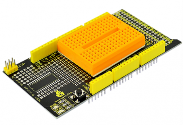
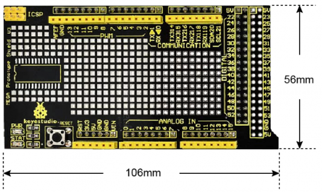
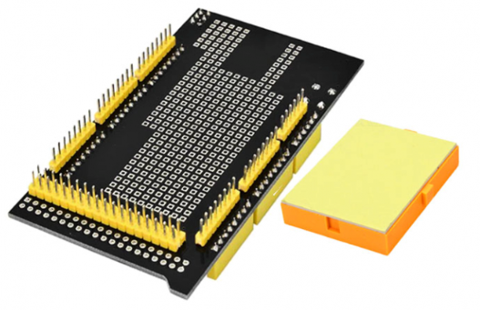
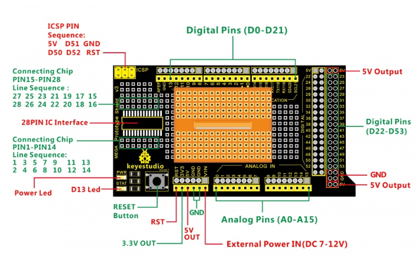
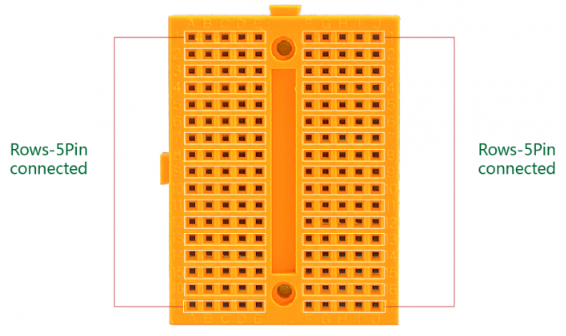
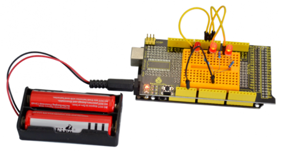
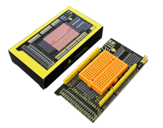

# KS0005 keyestudio MEGA ProtoShield V3 with Tiny Breadboard

## 1. Introduction

Keyestudio ProtoShield is particularly designed for the MEGA 2560. It makes it easy for you to design custom circuits and solder electronics directly on it.

For convenient use, there is a large prototyping space of both connected and unconnected spaced through-holes on the shield.

There is also a soldering position reserved for SMD chip on the protoshield. You can easily solder SMD ICs on the prototyping area to test them with your Arduino board.

It also extends out a row of power and ground through-holes, giving enough port resources.

You can even stick a tiny 170-holes breadboard (included) on the prototyping area. You can weld elements on the shield directly or connect circuits with tiny breadboard.

## 2. Features

- Can be plugged into the MEGA 2560 control board
- Extends 5V, 3V and Arduino Vin pins
- Comes with a Reset button
- Comes with a power led and a D13 indicator
- Extends an ICSP interface
- Extends out all the control pins and power pins of Arduino
- Able to build the prototyping circuits matched with Arduino
- Can weld with 28PIN chip
- Includes a tiny 170-hole breadboard

## 3. Controllers Compatible

- keyestudio MEGA 2560 R3
- Arduino MEGA 2560 R3

## 4. Technical Details

- Dimensions: 106mm x 56mm x 19mm
- Weight (only MEGA protoshield): 27.2g

**front view**

**Back View**

## 5. Pinout Instructions

## 6. Tiny Breadboard

This is a solderless tiny breadboard. It has 10 columns, and 17 rows - a total of 170 tie in points. This tiny breadboard has a self-adhesive on the back.You can stick it on the prototyping area of protoshield for solderless operation.

## 7. Example Use

You can first stick the 170-tie points breadboard on the prototyping area of Proto Shield. Stack the shield onto UNO R3 board. Use several LEDs, resistors and breadboard jumper wires to build the circuit experiments.

## 8. Package List

- keyestudio MEGA ProtoShield V3 * 1pcs
- Tiny Breadboard * 1pcs

